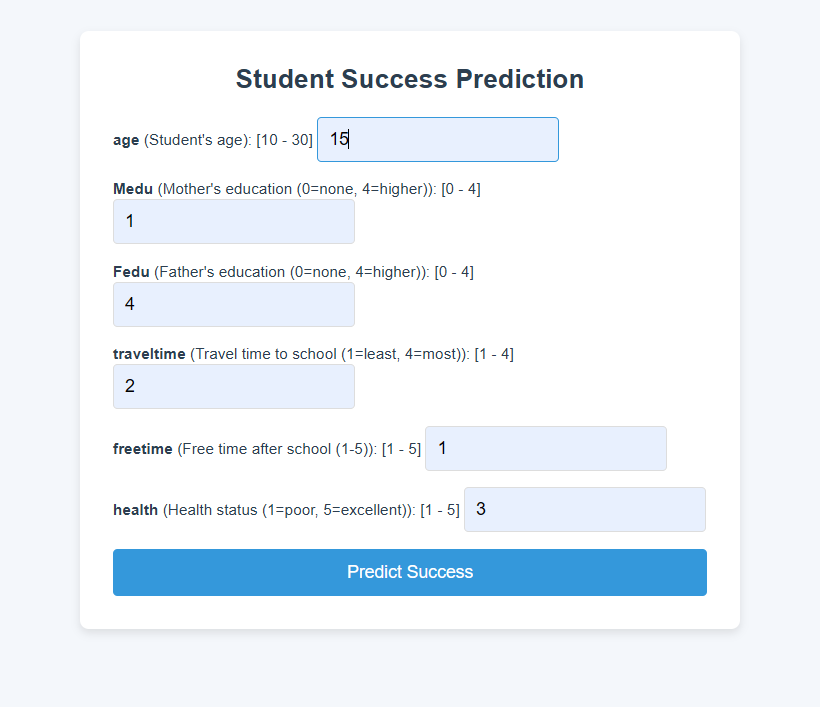
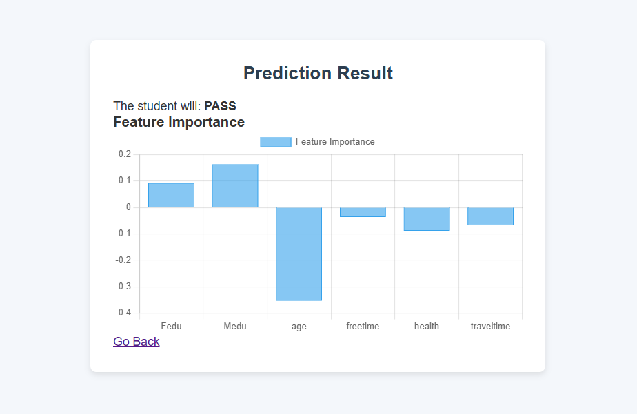

# Student Success Predictor

This is a web app built using **Flask** and **scikit-learn** that predicts whether a student will pass or fail based on various features like age, absences, parental education, and more. The app includes a machine learning model trained with student data, and a Flask-based frontend for interacting with the model.

## Features
- **Input Form**: Allows users to enter student data, including age,  parental education level, traveling time, free time, health etc.
- **Prediction**: Based on the input, the model predicts whether the student will **PASS** or **FAIL**.
- **Feature Importance**: After the prediction, the app displays which features influenced the prediction the most.
- **Data Validation**: The app checks that all inputs are within valid ranges to ensure correct data entry.

## Screenshots

### Example Form
Here’s the form where the user inputs student data:



### Prediction Result
After the form is submitted, the result is displayed here:



## Installation

Follow these steps to run the project locally:

### 1. Clone the Repository
Clone the project repository to your local machine:

```bash
git clone https://github.com/yourusername/student-success-predictor
cd student-success-predictor
